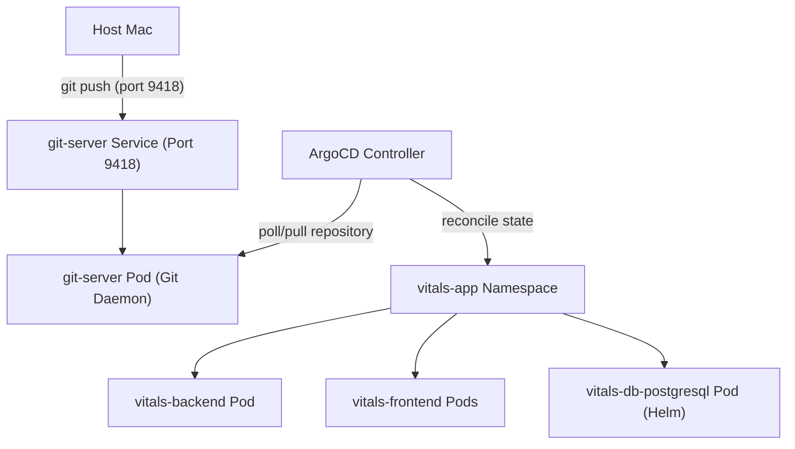

# GitOps Galaxy: Declarative Continuous Delivery with Helm & ArgoCD

This project demonstrates the transition of a microservices application (Go Backend + NodeJS Frontend) from static Kubernetes manifests (`cluster-chronicles`) to a dynamic, automated **GitOps Workflow** using **Helm** for packaging and **ArgoCD** for continuous reconciliation.

It also configures an in-cluster **PostgreSQL Database** via Helm with persistent storage and resource quotas, verified through an automated Kubernetes Job.

---

## 🛠️ 1. Infrastructure Overview



To run this project fully offline locally without external repository credentials, we deploy a lightweight, bare-metal **Git Server Daemon** (`git-server`) inside the cluster. It serves as our remote repository host.

---

## 🚀 2. Cluster Setup & Installation

### Step 1: Start Minikube & Enable Addons
```bash
minikube start --driver=docker --cpus=4 --memory=6144
minikube addons enable ingress
minikube addons enable metrics-server
```

### Step 2: Set Namespace Resource Quotas
Apply namespace limits to prevent CPU/Memory exhaustion:
```bash
kubectl apply -f manifests/namespace-limits.yaml
```

### Step 3: Deploy PostgreSQL Database via Helm
Add the Bitnami repository and install PostgreSQL with strict memory caps and persistence enabled:
```bash
helm repo add bitnami https://charts.bitnami.com/bitnami
helm repo update
helm install vitals-db bitnami/postgresql -n vitals-app --create-namespace \
  --set primary.persistence.size=1Gi \
  --set primary.resources.requests.memory=128Mi \
  --set primary.resources.limits.memory=256Mi \
  --set primary.resources.requests.cpu=50m \
  --set primary.resources.limits.cpu=100m \
  --set auth.database=vitals \
  --set auth.username=vitals_user \
  --set auth.password=vitals_password \
  --set readReplicas.resources.requests.memory=128Mi \
  --set readReplicas.resources.limits.memory=256Mi
```

### Step 4: Deploy the In-Cluster Git Server
Apply the git server service and deployment configurations:
```bash
kubectl apply -f manifests/git-server.yaml
```
Once the pod is running, configure its HEAD symbolic reference:
```bash
kubectl exec -n vitals-app deployment/git-server -c git-server -- git --git-dir=/git/gitops-galaxy.git symbolic-ref HEAD refs/heads/main
```

### Step 5: Push your Code to the Cluster Git Server
1. Start port-forwarding on port 9418 to expose the Git server to your local machine:
   ```bash
   kubectl port-forward -n vitals-app service/git-server 9418:9418 &
   ```
2. Initialize Git, add the remote, and push:
   ```bash
   git init
   git checkout -b main
   git config user.email "william@kood.tech"
   git config user.name "William"
   git add .
   git commit -m "Initial commit of Helm charts and manifests"
   git remote add origin git://127.0.0.1:9418/gitops-galaxy.git
   git push -u origin main
   ```

### Step 6: Deploy ArgoCD via Helm
Install a resource-optimized, non-HA installation of ArgoCD:
```bash
helm repo add argo https://argoproj.github.io/argo-helm
helm repo update
helm install argocd argo/argo-cd --namespace argocd --create-namespace \
  --set controller.resources.requests.memory=128Mi \
  --set controller.resources.limits.memory=256Mi \
  --set server.resources.requests.memory=64Mi \
  --set server.resources.limits.memory=128Mi \
  --set repoServer.resources.requests.memory=64Mi \
  --set repoServer.resources.limits.memory=128Mi \
  --set applicationSet.enabled=false \
  --set notifications.enabled=false \
  --set dex.enabled=false \
  --set redis.resources.requests.memory=32Mi \
  --set redis.resources.limits.memory=64Mi \
  --set global.imageSignatures.enabled=false
```

### Step 7: Apply the ArgoCD Application Manifest
Deploy the CD Application watcher to sync the Helm chart from the git server:
```bash
kubectl apply -f manifests/argocd-app.yaml
```

---

## 🔬 3. Validation & Testing Runbook

### Test 1: Verify PostgreSQL Connectivity (Batch Job)
Apply the batch Job which writes and reads from PostgreSQL:
```bash
kubectl apply -f manifests/database-job.yaml
```
Verify the job status and logs:
```bash
kubectl get jobs -n vitals-app
# Expected: COMPLETIONS 1/1

kubectl logs -n vitals-app -l job-name=postgres-connection-check
# Expected: "PostgreSQL Connection Successful! Read/Write test passed."
```

### Test 2: Access the ArgoCD Dashboard UI
1. Retrieve the autogenerated ArgoCD admin password:
   ```bash
   kubectl -n argocd get secret argocd-initial-admin-secret -o jsonpath="{.data.password}" | base64 -d; echo
   ```
2. Port-forward the ArgoCD UI:
   ```bash
   kubectl port-forward service/argocd-server -n argocd 8080:443
   ```
3. Open `https://localhost:8080` in your browser, log in as `admin`, and review the `vitals-app` tree.

### Test 3: Demonstrate Configuration Drift & Self-Healing (SRE Interview Scenario)
Manually scale the frontend deployment replicas via `kubectl`:
```bash
kubectl scale deployment vitals-frontend -n vitals-app --replicas=4
```
Within seconds, execute:
```bash
kubectl get deployment vitals-frontend -n vitals-app
```
**Expected Outcome**: ArgoCD detects the discrepancy against Git (which declares 2 replicas). It flags the state as `OutOfSync` and instantly reconciles the cluster, scaling it back down to `2/2` replicas automatically.
