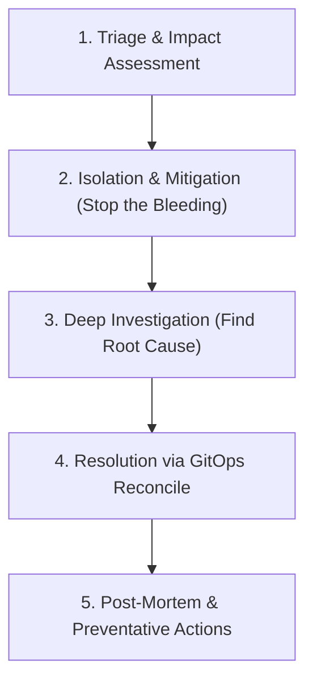

# Production Incident Response Runbook: A Senior DevOps Guide

When a production system breaks, panic is your worst enemy. What should you do professionally and quickly? Senior SRE/DevOps engineers follow a structured **5-Stage Incident Response Framework** to resolve outages safely, methodically, and quickly.

---

## The 5-Stage Triage Framework



---

## Stage 1: Triage & Impact Assessment
*Goal: Understand the scope of the outage. Is the system completely down or just degraded? Who is affected?*

1. **Verify External Access**: Check the ingress endpoint from your local host or browser:
   ```bash
   curl -I http://vitals.local:8080/health
   ```
2. **Audit Namespace Health**: Get a bird's-eye view of all pods in the namespace:
   ```bash
   kubectl get pods -n vitals-app
   ```
   *Look for: `CrashLoopBackOff`, `ErrImagePull`, `Pending`, or pods with high restart counts.*
3. **Check Node Resource Consumption**: Determine if the host node itself is saturated:
   ```bash
   kubectl top nodes
   kubectl top pods -n vitals-app
   ```

---

## Stage 2: Isolation & Mitigation (Stop the Bleeding)
*Goal: Bring the service back online immediately. Mitigate first, investigate later. **Never spend 3 hours diagnosing a bug while users see 500 errors.***

1. **Perform a GitOps Rollback (The Fastest Fix)**:
   If the outage occurred immediately after a deployment, roll back the code in Git:
   ```bash
   # Revert the last commit
   git revert HEAD
   git push origin main
   ```
   *ArgoCD will detect the revert and roll back the pods within seconds.*
2. **Force-Sync via ArgoCD UI/CLI**:
   If the cluster is in an unstable state, trigger a hard sync to overwrite manual edits:
   ```bash
   # Sync application, discarding drift and force replacing resources
   kubectl patch app vitals-app -n argocd --type merge -p '{"spec":{"syncPolicy":{"automated":{"prune":true,"selfHeal":true}}}}'
   ```
3. **Restart Pods Safely**:
   If a pod is stuck, trigger a rolling restart (zero downtime):
   ```bash
   kubectl rollout restart deployment/vitals-frontend -n vitals-app
   ```

---

## Stage 3: Deep Investigation (Find Root Cause)
*Goal: Diagnose why the failure occurred using cluster diagnostics.*

1. **Inspect Event Stream (Chronological Audit)**:
   Retrieve cluster events sorted by time to see what broke first:
   ```bash
   kubectl get events -n vitals-app --sort-by='.metadata.creationTimestamp'
   ```
   *Look for: failed liveness probes, quota limits breached, or storage mounting timeouts.*
2. **Describe Failed Resources**:
   Inspect a failing pod's lifecycle history, exit codes, and volume mounts:
   ```bash
   kubectl describe pod -l app=vitals-backend -n vitals-app
   ```
   *Identify Key Exit Codes:*
   * **Exit Code `137`**: Container was terminated by the OS kernel due to **OOMKilled** (Out Of Memory). Fix: increase memory limits in `values.yaml`.
   * **Exit Code `0`**: Main process exited normally (usually indicates a configuration or routing mistake).
   * **Exit Code `1` or `2`**: Application threw an internal runtime crash.
3. **Extract Log Files**:
   Retrieve the stdout and stderr streams:
   ```bash
   # Get recent logs of the backend deployment
   kubectl logs -l app=vitals-backend -n vitals-app --tail=200
   
   # Retrieve logs from the PREVIOUS crashed container instance
   kubectl logs -l app=vitals-backend -n vitals-app -p
   ```
4. **Debug Network Paths Internally**:
   Spawn a temporary debug container in the namespace to test DNS resolving and database ports:
   ```bash
   kubectl run curl-debug --rm -it --image=curlimages/curl --namespace=vitals-app -- sh
   
   # Internally test backend route
   curl http://vitals-backend-service:8080/health
   
   # Test postgres connection port
   nc -zv vitals-db-postgresql 5432
   ```

---

## Stage 4: Resolution via GitOps Reconcile
*Goal: Permanently fix the bug. **Never run direct `kubectl edit` commands in production.** Always resolve issues by committing to Git.*

1. **Modify Configuration**:
   Update `values.yaml` (e.g. increase memory limits if it was OOMKilled, or fix a port typo).
2. **Commit and Push**:
   ```bash
   git add charts/vitals-app/values.yaml
   git commit -m "fix(ops): raise backend memory limits to 256Mi to resolve OOMKilled error"
   git push origin main
   ```
3. **Verify Reconciliation**:
   Check that ArgoCD synced the commit and that new pods pass their readiness checks:
   ```bash
   kubectl rollout status deployment/vitals-backend -n vitals-app
   ```

---

## Stage 5: Post-Mortem & Preventative Actions
*Goal: Ensure the failure never happens again.*

1. **Conduct a Blameless Post-Mortem**: Document the timeline:
   * *When did the alerts fire?*
   * *What was the root cause?*
   * *How was it mitigated?*
2. **Adjust Quotas and Alerts**:
   If limits were too tight, edit `namespace-limits.yaml`. If alerts fired too late, adjust Prometheus alerting rules in `prometheus-rules.yaml`.
